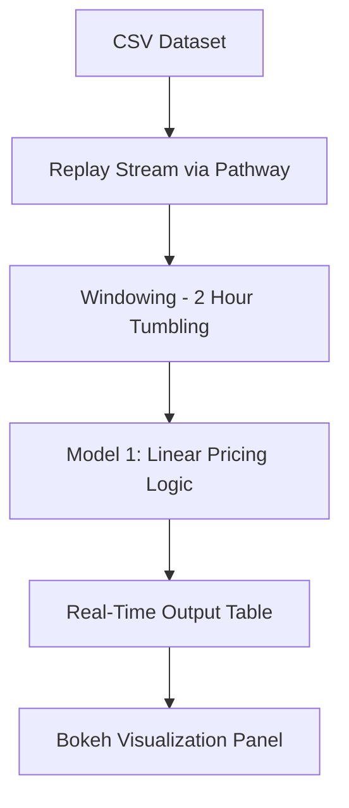

# Dynamic Parking Pricing System  
Capstone Project – Summer Analytics 2025

---

##  Overview

Urban parking lots often suffer from inefficient pricing — leading to either overcrowding or underutilization.  
This project implements a real-time dynamic pricing engine for urban parking spaces using Pathway for data streaming and Bokeh for real-time visualization.

Built as part of the Summer Analytics 2025 Capstone hosted by the Consulting & Analytics Club.

---

## Model Implemented

### Model 1: Baseline Linear Pricing

A simple model where prices increase linearly with occupancy:

```
Price = 10 + 10 × (Occupancy / Capacity)
```

✔Smooth and explainable price changes  
✔Real-time updates with a 2-hour tumbling window  
✔Pricing varies from $10 to $20 based on demand

---

## Tech Stack

| Layer             | Technology         |
|------------------|--------------------|
| Data Streaming    | Pathway            |
| Data Processing   | Pandas, NumPy      |
| Visualization     | Bokeh, Panel       |
| Platform          | Google Colab       |
| Dataset Format    | CSV                |

---


<details>
<summary>📐 Click to Expand Architecture Diagram (Mermaid)</summary>



</details>

---

## Dataset Fields Used

- `Timestamp` – Combined from date & time  
- `Occupancy` – Number of vehicles parked  
- `Capacity` – Max vehicles that can be parked  
- `QueueLength` – Vehicles waiting  
- `VehicleType` – car, bike, or truck  
- `Traffic` – Congestion level nearby  
- `IsSpecialDay` – 1 if holiday or event, else 0  

---

## Future Work

- Model 2: Demand-Based Pricing
- Model 3: Competitive Pricing Based on Location

---

## Acknowledgements

This project is part of Summer Analytics 2025, conducted by the  
Consulting & Analytics Club × Pathway.

---
